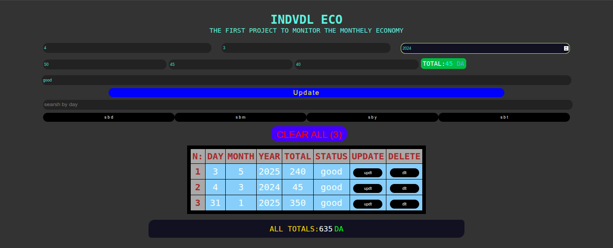

# CRUD + Search App

A simple JavaScript project that demonstrates all the main concepts of web development: **Create, Read, Update, Delete (CRUD)** and **Search**. Data is stored in the browser's **localStorage**, and the UI updates dynamically using DOM manipulation.

---

## 🚀 Features

* Add new records easily (Create)
* Display all stored records in a dynamic table (Read)
* Edit and update existing records (Update)
* Delete single records or clear all (Delete)
* Search by **day**, **month**, **year**, or **total** (Search)
* Data persistence using **localStorage**
* Simple and responsive interface

---

## 🛠️ Tools & Installation

No external installation required. Just open the `index.html` file in your browser.

**Tools used:**

* Browser (Chrome, Firefox, Edge, etc.)
* Code editor (VS Code recommended)

---

## 📸 Screenshots

### empty table

### Records Table

### update mode

---

## 🌐 Demo

[Live Demo](https://ice-machine.github.io/CRUDS)

---

## 📚 Concepts Covered

This project is perfect for beginners learning JavaScript. It covers:

* DOM Manipulation
* Event Handling
* LocalStorage API
* CRUD operations
* Search functionality

---

## 👨‍💻 Author

Developed by **Walid (the machine developer)**.
